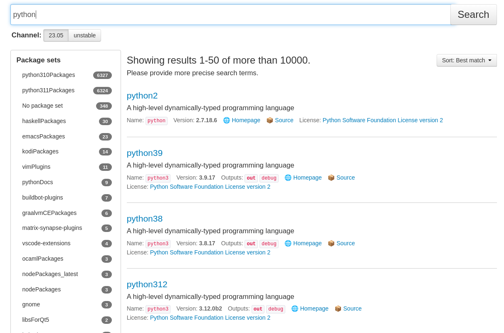

% nix
% déploiements fonctionnels
% Gautier DI FOLCO, HumanTalks Lyon, 10/10/2023

# nix

## Génèse

* 2003
* Utrecht University
* Simplification des déploiements

## Syntaxe

```
let
  greet = morning: name:
    if morning
    then "Hello ${name}"
    else "Goodbye ${name}";
in
greet true "Marvin"
```

```
nix-repl> a = import ./.
nix-repl> a
"Hello Marvin"
```

## Syntaxe

```
{
    a = 1;
    b = 2;
    c = 3;
}
```

```
nix-repl> orig // {c=10;d=11;}
{ a = 1; b = 2; c = 10; d = 11; }
```

## Syntaxe

```
builtins.removeAttrs { x = 1; y = 2; z = 3; } [ "a" "x" "z" ]
```

## Derivation

```nix
let
  pkgs = import <nixpkgs> { };

in
pkgs.stdenv.mkDerivation {
  name = "hello";

  src = pkgs.fetchurl {
    url = "https://ftp.gnu.org/gnu/hello/hello-2.12.1.tar.gz";
    sha256 = "sha256-jZkUKv2SV28wsM18tCqNxoCZmLxdYH2Idh9RLibH2yA=";
  };
}
```

## Derivation

```
$ nix build --file hello.nix
$ readlink result
 /nix/store/sslcqdn86gd142af16039x0dlrcw87vw-hello
$ tree $(readlink result)
  /nix/store/sslcqdn86gd142af16039x0dlrcw87vw-hello
  ├── bin
  │   └── hello
  └── share
      ├── info
          │   └── hello.info
              ├── locale
                  │   ├── ast
                      │   │   └── LC_MESSAGES
                          │   │       └── hello.mo
                              │   ├── bg
                                  │   │   └── LC_MESSAGES
                                      │   │       └── hello.mo
                                      ...
```

## Derivation

```
$ result/bin/hello
Hello, world!
```

## `/nix/store`


## Derivation

```nix
buildNpmPackage {
  pname = "hellojs";
  version = "4.2.0";

  src = ./.;
}
```

# nixpkgs

* Repositories de nombreux langages déjà supportés
* <https://github.com/nixos/nixpkgs>
* 80.000+ packages / ~500.000 commits

## NixOS search

* Moteur de recherche <https://search.nixos.org/packages>



# Outils
## `nix-shell`

```sh
$ nix-shell \
  -p python \
  --run 'python -m http.server --directory /tmp/'
```

## `nix-shell`

```sh
$ nix-shell \
  -I nixpkgs=https://github.com/NixOS/nixpkgs/archive/8a3ee....tar.gz \
  -p python \
  --run 'python -m http.server --directory /tmp/'
```

## nix flake

```nix
{
  inputs = {
    nixpkgs.url = "github:NixOS/nixpkgs";
    flake-utils.url = "github:numtide/flake-utils/8a3eea054838b55aca962c3fbde9c83c102b8bf2";
  };

  outputs = { self, nixpkgs, flake-utils }:
    # ...
    {
      defaultPackage =
        haskellPackages.callCabal2nix "myproject" ./. rec {};

      devShell = pkgs.mkShell {
        buildInputs = with haskellPackages; [
              haskell-language-server
              ormolu
            ];
      };
    };
}
```

## direnv

```
$ cd ~/myproject
direnv: loading ~/myproject/.envrc
direnv: using flake
direnv: export +AR +AS +CC +CONFIG_SHELL +CXX +HOST_PATH +IN_NIX_SHELL +LD +NIX_BINTOOLS +NIX_BINTOOLS_WRAPPER_TARGET_HOST_x86_64_unknown_linux_gnu ...
```

## devenv

```
{ pkgs, ... }: {
  env.GREET = "determinism";

  packages = [ pkgs.git ];

  enterShell = "echo hello $GREET";

  languages = {
    rust.enable = true;
    typescript.enable = true;
  };

  pre-commit.hooks = {
    clippy.enable = true;
    rustfmt.enable = true;
  };
}
```

# Conclusion

* Build reproductible, isolé
* Cache binaire
* Test d'intégration multi-systèmes
* Cross-compilation
* Distribution complète (NixOS)

# Extra slides
## NixOS

```
{ config, pkgs, lib, ... }:
{
  boot.loader.grub.devices = [ "/dev/sda" ];

  fileSystems."/".device = "/dev/disk/by-label/root";

  services.openssh.enable = true;

  users = {
    mutableUsers = false;

    users.marvin = {
      isNormalUser = true;

      extraGroups = [ "wheel" ];

      openssh.authorizedKeys.keys =
        [ "ssh-ed25519 AAA... example@example.com" ];
    };
  };
}
```
